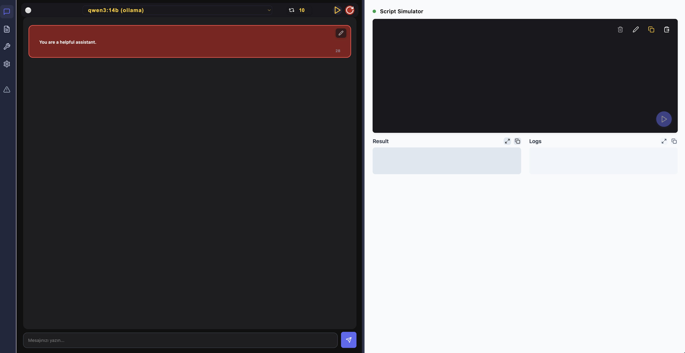

# 🧠 XRAY: Context-Aware LLM Agentic Prompt Optimization Tool 

#  DB-GPT: AI Native Data App Development framework with AWEL and Agents

XRAY is a memory-centric, OpenAI-compatible LLM orchestrator that supports function-calling (tool-calls), context replay, and persistent memory snippets via token-based referencing.

[screenshot](images/ss1.jpg)

## 🚀 Features

- ✅ **ContextMemory**: Stores all messages during a session with support for replay and refinement.
- 🧠 **TemporalMemory**: Lets you save and recall important snippets via `#tags`.
- 🔌 **ToolRouter**: Aggregates multiple tool clients under a single interface.
- 🌐 **WebSocket & CLI Tool Clients**: Dynamically interact with tools via UI or subprocesses.
- 🧼 **Refine System**: Trims overly long tool responses and returns a clean message history.
- ⏪ **Replay Functionality**: Replays a prior conversation chain through the model.
- 📤 **WebSocket Bridge**: Broadcasts live message updates to frontend clients.

---

## 📦 Installation

### 1. Requirements

- Python 3.9+
- OpenAI account and API key
- Required Python packages: `nanoid`, `fastapi`, `uvicorn`, `websockets`, `python-dotenv`, `PyYAML`, `pydantic`, etc.

### 2. .env File

Create a `.env` file and set your keys:

```env
OPENAI_API_KEY=sk-...
OPENAI_BASE_URL=https://api.openai.com/v1
````

### 3. Configuration

Define your models and tools in `xray_config.yaml`:

```yaml
xray:
  mongo_uri: mongodb://localhost:27017
  db_name: xray

models:
  - id: gpt-4
    label: GPT-4
    api_key: ${OPENAI_API_KEY}
    base_url: ${OPENAI_BASE_URL}

tools:
  - id: shell
    type: stdio
    command: ./tools/shell_tool.py
  - id: search
    type: websocket
    url: ws://localhost:9000/ws
```

---

## 🔧 Usage

### Start the Server

```bash
python xray-api.py
```

Open the app at:
📍 `http://localhost:8000`

### Chat Endpoints

* `POST /api/chat/ask`: Send a message (non-streaming)
* `POST /api/chat/ask_stream`: Streamed response
* `POST /api/chat/stop`: Cancel active generation

### Memory API

* `GET /api/chat/prompts`: Fetch all messages
* `POST /api/chat/prompts`: Replace message history
* `PATCH /api/chat/{msg_id}`: Update a message
* `DELETE /api/chat/{msg_id}`: Delete a message
* `POST /api/chat/delete_after/{msg_id}`: Delete everything after a message

---

## 🧠 Temporal Memory (Optional)

```python
from temporal_memory import TemporalMemory

tm = TemporalMemory(system="...")
msg_id = tm.add_message({"role": "assistant", "content": "Important snippet"})
tm.memorize("notes:important", msg_id, "Initial project summary")
```

Then reference in your prompt using: `#notes:important`

---

## 🛠 Dynamic UI Tools

To add a tool from the UI side:

```json
POST /api/ui_tools/add
{
  "name": "search_documents",
  "description": "Search within documents",
  "parameters": {
    "type": "object",
    "properties": {
      "query": { "type": "string", "description": "Search keyword" }
    },
    "required": ["query"]
  }
}
```

Return the result via WebSocket using the corresponding `call_id`.

---

## 📁 Project Structure

```plaintext
├── xray-api.py              # Main FastAPI server
├── context_memory.py        # Base memory logic
├── temporal_memory.py       # Snippet-based memory system
├── openai_agent.py          # OpenAI integration with tool loop
├── xray_config.py           # Config reader for models/tools
├── tool_router.py           # Router to direct tool calls
├── tool_websocket_client.py # WebSocket-based tool client
├── tool_stdio_client.py     # CLI-based tool client
```

---

## 📜 License

MIT License © 2025

---

## 👨‍💻 Contributing

Pull requests and suggestions are welcome!
For development, run:

```bash
uvicorn xray-api:app --reload
```

---

## ✨ Notes

* Large tool outputs are trimmed unless referenced via `#token`.
* Tool calls are paired with their responses in assistant memory.
* Use `/ws/bridge` for live WebSocket updates to the UI.

---